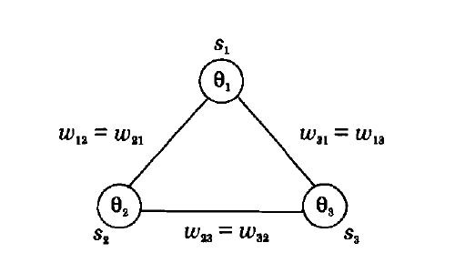
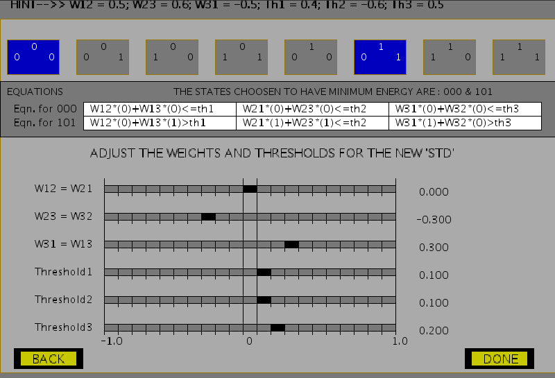
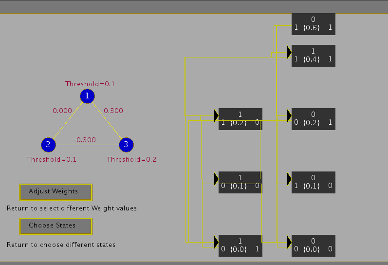
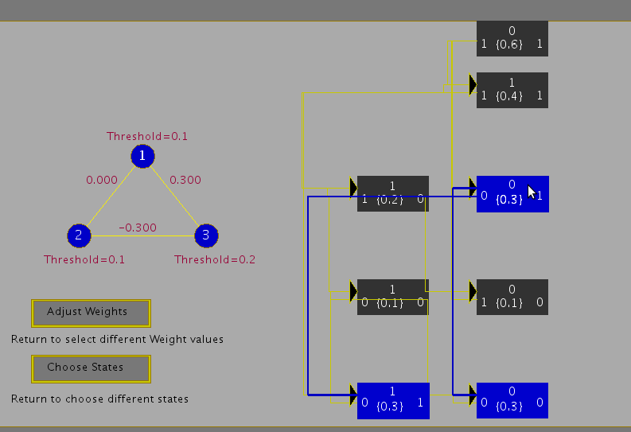

## Pattern Storage Network

Pattern storage is generally accomplished by a feedback network consisting of processing units with non-linear output functions. The outputs of all the processing units at any instant of time define the output state of the network at that instant. Associated with each output state is an energy, which depends on the network parameters like the weights and bias, besides the state of the network. The energy as a function of state corresponds to an energy landscape. The feedback among the units and the non-linear processing in the units may create basins of attraction in the energy landscape when the weights satisfy certain constraints. The basins of attraction in the energy landscape tend to be the regions of stable equilibrium states. The fixed points in these regions correspond to the state of the energy minima, and they are used to store the desired patterns. These stored patterns can be recalled even with approximate patterns as inputs. The number of patterns that can be stored is called the capacity of the network. The following figures illustrate the concept of energy landscape. Figure 1(a) shows the energy landscapes with each minimum state supported by several non-minimum states around its neighborhood. Figure 1(b) does not have any such support for the minimum states. Hence, patterns can be stored if the energy landscape of the type in Figure 1(a) is realized by suitable design of the feedback network.

**Figure 1**: *Illustration of energy landscapes.*

---

## The Hopfield Model

We use the Hopfield model of a feedback network for addressing the task of pattern storage. The perceptron neuron model for the units of a feedback network is used, where the output of each unit is fed to all the other units with weights \( w_{ij} \), for all \( i \) and \( j \). Let the output function of each of the units be bipolar (+1 or -1), so that:

\[
s_i = f(x_i) = \text{sgn}(x_i) \qquad(1)
\]

and

\[
x_i = \sum\limits_{j=1}^{N} w_{ij}s_j - \theta_i \qquad(2)
\]

where \( \theta_i \) is the threshold for the unit \( i \). Due to feedback, the state of a unit depends on the states of the other units. The update of the state of a unit can be done synchronously or asynchronously. In an asynchronous update, the updating using the random choice of a unit is continued until no further change in the states takes place for all the units. That is:

\[
s_i(t+1) = s_i(t), \quad \text{for all } i
\]

In this situation, we can say that the network activation dynamics reached a stable state.

---

## Hopfield Network Algorithm to Store and Recall a Set of Bipolar Patterns

Let the network consist of \( N \) fully connected units with each unit having a hard-limiting bipolar threshold output function. Let \( \mathbf{a}_l \), \( l = 1, 2, \dots, L \) be the vectors to be stored. The vectors \( \mathbf{a}_l \) are assumed to have bipolar components, i.e., \( a_{li} = \pm 1 \), \( i = 1, 2, \dots, N \).

1. **Assign the connection weights**:
   \[
   w_{ij} = \frac{1}{N} \sum\limits_{l=1}^{L} a_{li} a_{lj}, \quad \text{for } i \ne j
   \]
   \[
   w_{ij} = 0, \quad \text{for } i = j, \quad 1 \le i, j \le N \qquad(3)
   \]

2. **Initialize the network output with the given unknown input pattern \( \mathbf{a} \)**:
   \[
   s_i(0) = a_i, \quad \text{for } i = 1, 2, \dots, N \qquad(4)
   \]
   where \( s_i(0) \) is the output of the unit \( i \) at time \( t = 0 \).

3. **Iterate until convergence**:
   \[
   s_i(t+1) = \text{sgn} \left[ \sum\limits_{j=1}^{N} w_{ij} s_j(t) \right], \quad \text{for } i = 1, 2, \dots, N \qquad(5)
   \]
   The process is repeated until the outputs remain unchanged with further iteration. The steady outputs of the units represent the stored pattern that best matches the given input.

---

## Energy Analysis and State Transition Diagram

The energy \( V(\mathbf{s}) \) as a function of the state \( \mathbf{s} \) of the network describes the energy landscape in the state space. Its value always either reduces or remains the same as the state of the network changes. Assuming the threshold value of the unit \( i \) to be \( \theta_i \), the energy function is given by:

\[
V(\mathbf{s}) = -\frac{1}{2} \sum\limits_{i} \sum\limits_{j} w_{ij} s_i s_j + \sum\limits_{i} \theta_i s_i \qquad(6)
\]

The energy analysis of the Hopfield network shows that the network either remains in the same state or moves to a state having a lower energy. This can be demonstrated by means of a state transition diagram, which gives the states of the network and their energies, together with the probability of transition from one state to another.

---

### Illustration of State Transition Diagram for a 3-Unit Feedback Network

Consider a 3-unit feedback network with symmetric weights \( w_{ij} = w_{ji} \). The units have a threshold value of \( \theta_i \), \( i = 1, 2, 3 \), and a binary \( \{0, 1\} \) output function. A binary output function is assumed for convenience, although the conclusions are equally valid for the bipolar \( \{-1, +1\} \) case. The following figure shows a 3-unit feedback network. The state update for the unit \( i \) is governed by the following equation:

\[
s_i(t+1) = 
\begin{cases} 
1, & \text{if } \sum\limits_{j} w_{ij} s_j(t) > \theta_i \\
0, & \text{if } \sum\limits_{j} w_{ij} s_j(t) \le \theta_i 
\end{cases} \qquad(7)
\]

**Figure 2**: *A 3-unit feedback network with symmetric weights \( w_{ij} \), threshold values \( \theta_i \), and the output states \( s_i \), \( i = 1, 2, 3 \).*

---

#### Assuming the Values

\[
w_{12} = w_{21} = -0.5, \quad w_{23} = w_{32} = 0.4, \quad w_{31} = w_{13} = 0.5
\]
\[
\theta_1 = -0.1, \quad \theta_2 = -0.2, \quad \theta_3 = 0.7
\]

we get the following energy values for each state:

\[
V(000) = 0.0, \quad V(001) = 0.7, \quad V(010) = -0.2, \quad V(100) = -0.1
\]
\[
V(011) = 0.1, \quad V(101) = 0.1, \quad V(110) = 0.2, \quad V(111) = 0.0
\]

The transition from any state to the next state can be computed using the state update equation. For example, if the current state is 000, by selecting any one unit, say unit 2, at random, we can find its next state by computing the activation value \( x_2 \) and comparing it with the threshold \( \theta_2 \). Since \( x_2 (=0) > \theta_2 (= -0.2) \), the state of the unit 2 changes from 0 to 1. Thus, if we select this unit, there will be a transition from the state 000 to 010. Since we can select any one of the three units with equal probability, i.e., \( \frac{1}{3} \), the probability of making a transition from 000 to 010 is thus \( \frac{1}{3} \). Likewise, by selecting the unit 1 for update, the network makes a transition from 000 to 100 with a probability \( \frac{1}{3} \). Selecting the unit 3 for update results in a transition from 000 to itself, since the activation \( x_3 (=0) < \theta_3 (=0.7) \).

By computing the transition probabilities for all the states, we get the state transition diagram as shown in Figure 3.

**Figure 3**: *Illustration of state transition diagram for a 3-unit feedback network.*

---

Thus, a Hopfield Model generates an energy landscape where states in the model are associated with different energy values. Stable states are the states that lie at the bottom of this landscape or rather have minimum energies. These states can then be used for the pattern storage task. The following figures show the steps involved in the experiment to choose weights for a given Hopfield model, which ascertain some chosen states to attain stability. The capacity of a Hopfield model is determined by the number of patterns being stored as well as the probability of error that can be expected in the recall of patterns. For an \( N \)-unit network where \( L \) patterns are to be stored, for a probability of error of recall \( P_e = 0.001 \), the maximum storage capacity is given by:

\[
\frac{L_{\text{max}}}{N} = 0.105
\]

**Figure 4**: *Choosing minimum energy states in a Hopfield 3-unit feedback network.*

**Figure 5**: *Adjusting weights for the Hopfield 3-unit feedback network.*

**Figure 6**: *State transition diagram with states and respective energy values in curly brackets.*

**Figure 7**: *State transition diagram with probabilities of transition in curly brackets.*